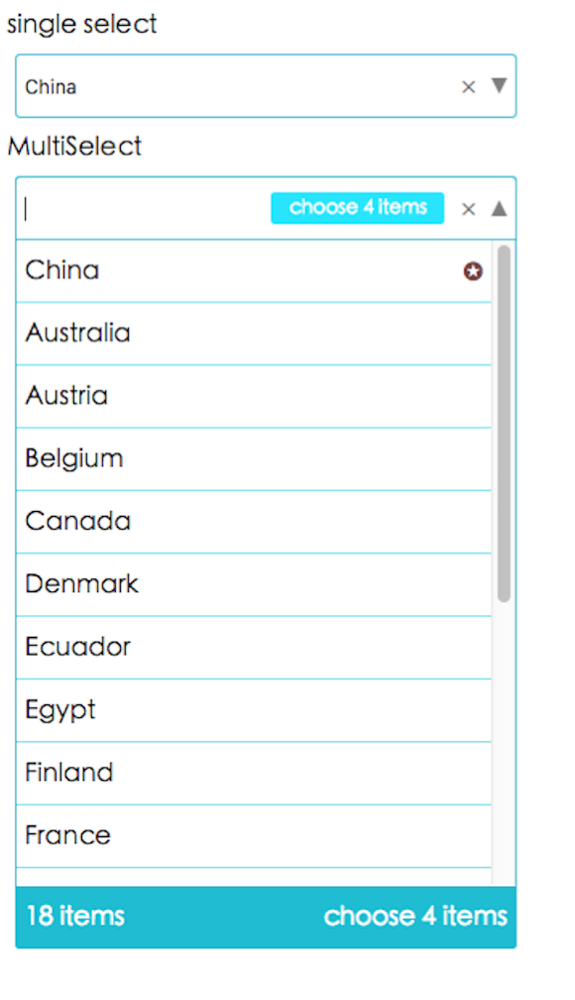

# AWESOMESELECT

This is a select component, provide `hot search`, `clean`, show `the number of items`. It is simple to use.
<br />
<font size="40" color="red">[`live demo`](https://stephenkingsley.github.io/)</font>
<br />


## use

    npm i --save react-awesome-select

And in you component

```javascript

import { AwesomeSelect } from 'react-awesome-select';

class Select extends React.Component {
  contructor() {
    super();
    this.state = {
      data: [
        { name: `China`, value: 1, selected: true },
        { name: `Australia`, value: 2 },
        { name: `Austria`, value: 3 },
        { name: `Belgium`, value: 4 },
        { name: `Canada`, value: 5 },
        { name: `Denmark`, value: 6 },
        { name: `Ecuador`, value: 7 },
        { name: `Egypt`, value: 8 },
        { name: `Finland`, value: 9 },
        { name: `France`, value: 10 },
        { name: `Georgia`, value: 11 },
        { name: `Germany`, value: 12 },
        { name: `Greece`, value: 13 },
        { name: `Hungary`, value: 14 },
        { name: `Iceland`, value: 15 },
        { name: `India`, value: 16, selected: true },
        { name: `Iran`, value: 17, selected: true },
        { name: `Italy`, value: 18, selected: true }
      ]
    };
  }

  render() {
    return (
      <AwesomeSelect
        style={{ width: '400px' }}
        data={this.state.data}
        mult
        onChange={(value, name, allChoose) => console.log(`---`, value, name, allChoose)}
      />
    );
  }
}

```

## Props

|props              |type                 |
|:------------------|--------------------:|
|data               |Array(isRequired)    |
|mult               |Bool(default: false) |
|style              |object               |
|onChange           |function(isRequired) |
|onBlur             |function             |

### data

```javascript

const data = [{
  name: 'Stephen.Kingsley',
  value: 1,
  selected: true
}];

```

### mult is MultiSelect,default is false

### style is the select style

### onChange(value, name, allChoose)

#### value is the item of value you click

#### name is the item of name you click

#### when `mult = true`. allChoose is what you selected

|params        |type     |
|:------------ |--------:|
|value         |string   |
|name          |string   |
|allChoose     |object   |

## localhost demo

    git clone https://github.com/stephenkingsley/react-select.git
    cd react-select
    npm install
    npm start
